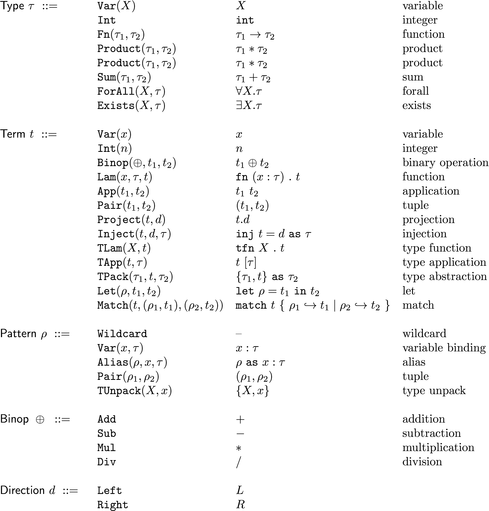
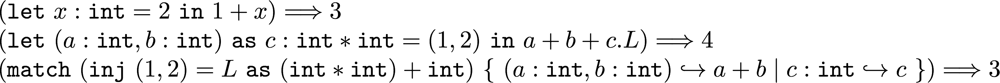
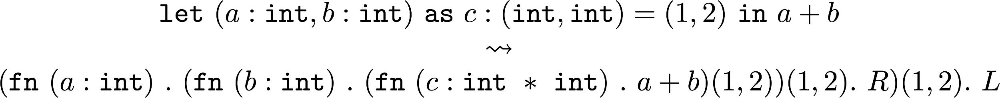
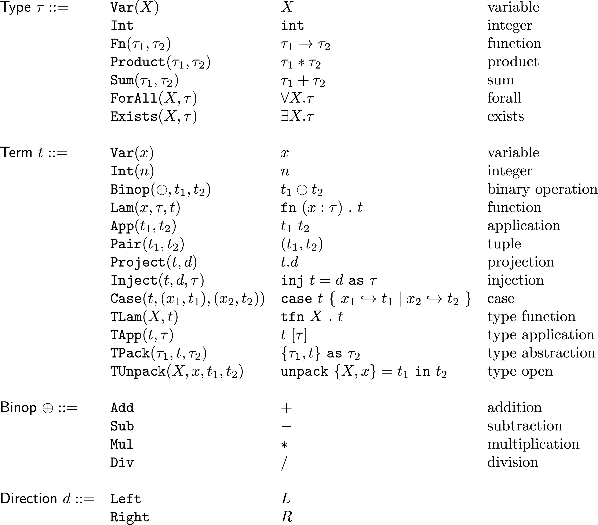
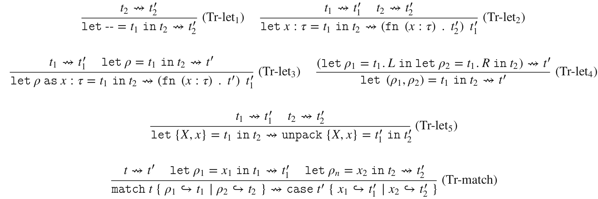
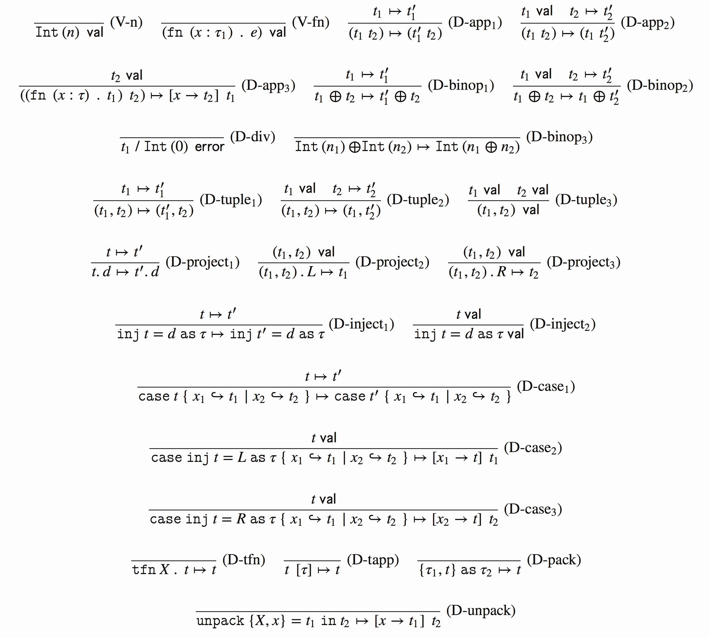

# PA3: Type System

<!-- TOC -->

- [Setup](#setup)
- [Requirements](#requirements)
- [Submitting](#submitting)
- [Language specification](#language-specification)
- [Part1: Translator](#part1-translator)
- [Part2: Typechecker](#part2-typechecker)
- [Part3: Interpreter](#part3-interpreter)
- [Testing](#testing)

<!-- /TOC -->

In this assignment, you will implement an interpreter for the exciting simply typed lambda calculus, or
 λ→! . Specifically you will extend our previous language λ→ (see [cs242/assign3](http://cs242.stanford.edu/assignments/assign3/)) with algebraic data types, pattern matching and polymorphic/existential types.

## Setup

Setup is same as always. Use `git pull` to get the newest version from [Github:ustc-fopl/2018s/](https://github.com/ustc-fopl/2018s)

Copy the `assign3` directory to your own git repository for submitting.

## Requirements

You must implement the translation, type checking, and interpretation stages of the interpreter. You will turn in these files:

* `translator.ml`
* `typechecker.ml`
* `interpreter.ml`


## Submitting

When you finish your  `assign3` , copy these three files to the git repository for upload, under a folder named `assign3`.

Then submit.

``` bash
git add assign3/{translator.ml, typechecker.ml, interpreter.ml}``
git commit
git push origin
```

**Note: We are grading tests that do not result in an error using exact text matching, and will not fix submissions that have extra print statements or the like. It is your responsibility to test before submitting**

## Language Specification

Adding algebraic data types, pattern matching, and first-order type logic to our language introduces a substantial level of complexity in both the language and its implementation. A common technique for mitigating complexity in language implementation is to use intermediate representations (IRs), or mini-languages internal to the interpreter. For our language $\lambda_{\rightarrow!}$, we have the top-level language defined by what the programmer will write as well an IR for our typechecker and interpreter.

First, we will examine the grammar for our new language. Specifically, we have added new types: `Product`, `Sum`, `ForAll`, `Exists` and the corresponding terms necessary to implement those types. These are precisely the same formulations as we discussed in class. Additionally, this language introduces pattern matching, a restricted version of the `match` clause you've used in OCaml.

<!--
$$
\begin{array}{llll}
\mathsf{Type}~\tau~::=~
& \mathtt{Var}(X)                      & X                             &  \text{variable} \\
& \mathtt{Int}                         & \mathtt{int}                  & \text{integer} \\
& \mathtt{Fn}(\tau_1, \tau_2)          & \tau_1 \rightarrow \tau_2     & \text{function} \\
& \mathtt{Product}(\tau_1, \tau_2)     & \tau_1 * \tau_2               & \text{product} \\
& \mathtt{Product}(\tau_1, \tau_2)     & \tau_1 * \tau_2               & \text{product} \\
& \mathtt{Sum}(\tau_1, \tau_2)         & \tau_1 + \tau_2               & \text{sum} \\
& \mathtt{ForAll}(X, \tau)             & \forall X.\tau                & \text{forall} \\
& \mathtt{Exists}(X, \tau)             & \exists X.\tau                & \text{exists} \\
\\
\mathsf{Term}~ t~::= ~
& \mathtt{Var}(x)                       & x                                               & \text{variable} \\
& \mathtt{Int}(n)                       & n                                               & \text{integer} \\
& \mathtt{Binop}(\oplus, t_1, t_2)      & t_1 \oplus t_2                                  & \text{binary operation} \\
& \mathtt{Lam}(x, \tau, t)              & \mathtt{fn} \ (x : \tau) \ . \ t                & \text{function} \\
& \mathtt{App}(t_1, t_2)                & t_1 \ t_2                                       & \text{application} \\
& \mathtt{Pair}(t_1, t_2)               & (t_1, t_2)                                      & \text{tuple} \\
& \mathtt{Project}(t, d)                & t.d                                             & \text{projection} \\
& \mathtt{Inject}(t, d, \tau)           & \mathtt{inj} \ t = d \ \mathtt{as} \ \tau       & \text{injection} \\
& \mathtt{TLam}(X, t)                   & \mathtt{tfn} \ X \ . \ t                        & \text{type function} \\
& \mathtt{TApp}(t, \tau)                & t \ [\tau]                                      & \text{type application} \\
& \mathtt{TPack}(\tau_1, t, \tau_2)     & \{ \tau_1, t \} \ \mathtt{as} \ \tau_2          & \text{type abstraction} \\
& \mathtt{Let}(\rho, t_1, t_2)          & \mathtt{let} \ \rho = t_1 \ \mathtt{in} \ t_2   & \text{let} \\
& \mathtt{Match}(t, (\rho_1, t_1), (\rho_2, t_2)) & \mathtt{match} \ t \ \{ \ \rho_1 \hookrightarrow t_1 \mid \rho_2 \hookrightarrow t_2 \ \} & \text{match} \\
\\
\mathsf{Pattern}~\rho~::= ~
& \mathtt{Wildcard}                     & \text{--}                           & \text{wildcard} \\
& \mathtt{Var}(x, \tau)                 & x : \tau                            & \text{variable binding} \\
& \mathtt{Alias}(\rho, x, \tau)         & \rho \ \mathtt{as} \ x : \tau       & \text{alias} \\
& \mathtt{Pair}(\rho_1,\rho_2)          & (\rho_1, \rho_2)                    & \text{tuple} \\
& \mathtt{TUnpack}(X, x)                & \{X, x\}                            & \text{type unpack} \\
\\
\mathsf{Binop}~\oplus ~::=~
& \mathtt{Add}          & +           & \text{addition} \\
& \mathtt{Sub}          & -           & \text{subtraction} \\
& \mathtt{Mul}          & *           & \text{multiplication} \\
& \mathtt{Div}          & /           & \text{division} \\
\\
\mathsf{Direction}~d ~::=~
& \mathtt{Left}      & L       &\\
& \mathtt{Right}     & R       &\\
\end{array}
$$
-->



As a refresher from lecture, `Inject` “injects” the term *t* as the left or right side of the sum type *τ* , depending on what *d* is. `TLam` and `TApp` are similar to `Lam` and `App` except that they	operate on types, and not  terms. That means `TLam` maps a variable name to a type *τ* and not a term *t* . `TApp` expects a type *τ* as an argument for some `TLam`.

`TPack`, `Exists`, and `TUnpack` are intimately related. `TPack` is always used with the type `Exists`. `Exists` states that there exists a type *X* that looks like the type *τ*. This essentially allows us to define abstract interfaces. `TPack`, "Packs" a concrete implementation of some type *τ_1* into some existential type *τ_2*. `TUnpack` allows us to retrieve the concrete implementation.

As mentioned, all of the rules for algebraic data types and first order type logic mirror the semantics discussed in class, so refer back to those notes for more details. The pattern matching mechanism is novel, however, as this is the first time we will give it a formal treatment. Here's a few examples using patterns in this language.


<!--
$$
\begin{array}{ll}
&(\mathtt{let} \ x : \mathtt{int} = 2 \ \mathtt{in} \ 1 + x) \Longrightarrow 3 \\
&(\mathtt{let} \ (a : \mathtt{int}, b : \mathtt{int}) \ \mathtt{as} \ c : \mathtt{int} * \mathtt{int} = (1, 2) \ \mathtt{in} \ a + b + c.L) \Longrightarrow 4 \\
&(\mathtt{match} \ (\mathtt{inj} \ (1, 2) = L \ \mathtt{as} \ (\mathtt{int} * \mathtt{int}) + \mathtt{int}) \ \{ \ (a : \mathtt{int}, b : \mathtt{int}) \hookrightarrow a + b \mid c : \mathtt{int} \hookrightarrow c \ \}) \Longrightarrow 3
\end{array}
$$
-->



If we wanted to, we could stop here and define a full statics and semantics for the language above. However, we need not to, since we can translate some parts of the language into other. Specifically, we will eliminate pattern matching in a translation pass. For example, we could define the following translation of a
tuple match (where ⇝ means “translates to”):

<!--
$$ \begin{array}{c}
 \mathtt{let}\ (a : \mathtt{int}, b : \mathtt{int})\
\mathtt{as}\ c : (\mathtt{int},\mathtt{int}) = (1,2) \ \mathtt{in} \ a + b
\\
\leadsto \\
(\mathtt{fn}\ (a : \mathtt{int})\ . \ (\mathtt{fn}\ (b : \mathtt{int}) \ . \
(\mathtt{fn}\ (c : \mathtt{int}\ \ast\ \mathtt{int})\ . \ a + b)
(1,2))
(1,2). \ R) (1, 2). \ L
\end{array}
$$
-->



To formalize this translation, we will first define a grammar for a new IR:

<!--
$$
\begin{array}{llll}
\mathsf{Type}~\tau ::= & \mathtt{Var}(X) & X & \text{variable} \\
& \mathtt{Int} & \mathtt{int} & \text{integer}\\
& \mathtt{Fn}(\tau_1, \tau_2) & \tau_1 \rightarrow \tau_2 & \text{function} \\
& \mathtt{Product}(\tau_1, \tau_2) & \tau_1 * \tau_2 & \text{product} \\
& \mathtt{Sum}(\tau_1, \tau_2) & \tau_1 + \tau_2 & \text{sum} \\
& \mathtt{ForAll}(X, \tau) & \forall X.\tau & \text{forall} \\
& \mathtt{Exists}(X, \tau) & \exists X.\tau & \text{exists} \\
\\
\mathsf{Term}~t ::= & \mathtt{Var}(x) & x & \text{variable} \\
& \mathtt{Int}(n) & n & \text{integer} \\
& \mathtt{Binop}(\oplus, t_1, t_2) & t_1 \oplus t_2 & \text{binary operation} \\
& \mathtt{Lam}(x, \tau, t) & \mathtt{fn} \ (x : \tau) \ . \ t & \text{function} \\
& \mathtt{App}(t_1, t_2) & t_1 \ t_2 & \text{application} \\
& \mathtt{Pair}(t_1, t_2) & (t_1, t_2) & \text{tuple} \\
& \mathtt{Project}(t, d) & t.d & \text{projection} \\
& \mathtt{Inject}(t, d, \tau) & \mathtt{inj} \ t = d \ \mathtt{as} \ \tau & \text{injection} \\
& \mathtt{Case}(t, (x_1, t_1), (x_2, t_2)) & \mathtt{case} \ t \ \{ \ x_1 \hookrightarrow t_1 \mid x_2 \hookrightarrow t_2 \ \} & \text{case} \\
& \mathtt{TLam}(X, t) & \mathtt{tfn} \ X \ . \ t & \text{type function} \\
& \mathtt{TApp}(t, \tau) & t \ [\tau] & \text{type application} \\
& \mathtt{TPack}(\tau_1, t, \tau_2) & \{\tau_1, t\} \ \mathtt{as} \ \tau_2 & \text{type abstraction} \\
& \mathtt{TUnpack}(X, x, t_1, t_2) & \mathtt{unpack} \ \{X, x\} = t_1 \ \mathtt{in} \ t_2 & \text{type open} \\
\\
\mathsf{Binop}~\oplus ::= & \mathtt{Add} & + & \text{addition} \\
& \mathtt{Sub} & - & \text{subtraction} \\
& \mathtt{Mul} & * & \text{multiplication} \\
& \mathtt{Div} & / & \text{division} \\
\\
\mathsf{Direction}~d ::= & \mathtt{Left} & L \\
& \mathtt{Right} & R
\end{array}
$$
-->




This IR has three differences from the top-level:

1. Patterns are removed entirely.
2. `TUnpack` has moved from `Pattern` to `Term`.
3. `Match` has been replaced by `Case`.

In terms of the code, the first grammar corresponds to the `Lang` module in `ast.ml`, whereas the second corresponds to the `IR` module.


## Part1: Translator

Your first job is to implement the translation function in `translator.ml`:

``` ocaml
val translate : Lang.Term.t -> IR.Term.t
```

This function takes a term of the top-level language `Lang.Term.t` and converts it into an `IR.Term.t`. It cannot fail, so we do not return a `Result.t`.

The translation is largely trivial for most of the language as the only major difference is the `Lang.Term.Let` and `Lang.Term.Match` cases. We have implemented all of the trivial cases as well the `Match` case for you.

We can formalize the `Let` and `Match` translations by defining a series of translation rules:




Look at `Match` for an example of implementing one of these translation rules. After implementing these rules, you will have a complete pipeline to move from source code to your IR.

> Note: if we wanted to formally verify our translation rules, we could define a dynamics for both the top-level `Lang` and the `IR`, and then prove that for all  *t : τ* that if *t_L* ⇒ *t′_L* in `Lang` and *t_L* ⇝ *t_IR* then *t_IR* ⇒ *t′_IR* implies that *t′_L* ⇝ *t′_IR*.


## Part2: Type checker


Your next task is to implement a type checker for the IR. Because we decided to translate before type checking, this will reduce the complexity of the type checker (although this will obscure type errors–it’s a tricky business to match a type error on generated code back to the original source).

The format of the type checker is the mostly same as the previous assignment, but now the type system is more complex. The statics are:


There are two major additions: sum/product types and polymorphic/existential types. Type checking the former is straightforwardly derived from the rules like from the previous assignment, but the latter introduces a new concept: type variables. Now, your typing context keeps track of two things:

1. Mappings from term variables to types, notated by Γ, *x : τ* ⊢ *e : τ*. This is as before used for when term variables are introduced by lambdas, or here also case expressions.

2. Existence of type variables, notated by Γ, *X* ⊢ *e : τ*. Type variables do not map to anything, the context just tracks when a type variable is in scope (to catch type expressions that use an undefined type variable).

Concretely, you will implement the following function:

``` ocaml
val typecheck_term : String.Set.t -> Type.t String.Map.t -> Term.t -> Type.t
```

Where `typecheck_term type_env env t` returns the type of `t` if it exists. Note that instead of using a `Result.t`, this time you can use a simpler approach: whenever a type error occurs, you should raises a `TypeError` exception, e.g. `raise (TypError "Does not typecheck")`, with the appropriate error message. Otherwise, assume that when you call `typecheck_term` recursively you get back a valid type.

Here, `env` is the same mapping from variables to types as in the previous assignment, but we have added `tenv` which is a set of type variables. Type variables do not map to anything (they do not themselves have types), but instead just provide the context that a type variable is in scope during type checking of an expression.

We have provided you a function `typecheck_type : String.Set.t -> Type.t ->Type.t`. Whenever you’re type checking a term that contains a type specified by the user, for example the type annotation on a function or an injection, you will need to check that the provided type does not use unbound type variables.
For example, the following expression should not typecheck because *Y* is unbound:


Lastly, during typechecking, there will be points where you will want to compare the equality of two types. *Do not* use the equals operator  (e.g. `tau1 = tau2`) as that would be incorrect! Use the `Type.aequiv` function that compares two types for equality up to renaming of bound variables, or check them for *alpha-equivalence*. For example, the types ∀*X. X* and ∀*Y. Y* should be considered equal, however the `=` operator will return false because the variable names are different. `Type.aequiv` has the signature `Type.t -> Type.t -> bool`.


## Part3: Interpreter

Lastly, you must implement the interpreter. At this point, all of the terms relating to type abstraction (polymorphic/existential types) have trivial dynamics, since we’ve already verified our required type properties in the type checker. Most of the legwork is in supporting algebraic data types. The dynamics are as follows:



As in the previous assignment, you will implement these dynamics in the `trystep` function in `interpreter.ml`:

``` ocaml
val trystep : Term.t -> outcome
```

The dynamics for `Int` and `Var` as well as the dynamics for the polymorphic/existential cases are done for you.

## Testing

To build the interpreter, run `make`. This will create an executable, `main.byte`. This creates OCaml bytecode that needs to passed to `ocamlrun` to execute. We’ve provided two scripts `user.sh` and `solution.sh` for `main.byte`  and `solution.byte` respectively.

Running `run_tests.py` will run the test suite over all the files in the `tests` directory and compare them to our solution.

``` bash
python3 run_tests.py
```

Note that the tests are just a representative sample of the tests we will run your code on.

To test an individual file, you can use `user.sh` to invoke the interpreter manually, e.g.

``` bash
./user.sh tests/exists1.lam2
```

For each of the functions you have to implement, we have provided a few additional unit tests inside of an `inline_tests` function in each file. Uncomment the line that says:

``` ocaml
let () = inline_tests ()
```

And then execute `./user.sh` to run those tests. If it does not fail with an assertion error, you have passed those tests.


