# PA4: Logic Engine

<!-- TOC -->

- [Setup](#setup)
- [Requirements](#requirements)
- [Part 1: SAT solver](#part-1-sat-solver)
	- [Problem setup](#problem-setup)
	- [1a: Finding one assignment (15%)](#1a-finding-one-assignment-15)
	- [1b: Finding all assignments (25%)](#1b-finding-all-assignments-25)
	- [Testing](#testing)
- [Part 2: Datalog](#part-2-datalog)
	- [Prelude: Records and lists](#prelude-records-and-lists)
	- [Datalog preliminaries](#datalog-preliminaries)
	- [2a: Build (50%)](#2a-build-50)
	- [2b: Query (10%)](#2b-query-10)
	- [Testing](#testing-1)
- [Submitting](#submitting)

<!-- /TOC -->

In this assignment, you will explore two applications in the realm of logic programming that draw on the control flow and unification concepts we learned this week in class. You will implement a boolean satisfiability solver as well as a symbolic predicate database.

## Setup

Setup is same as always. Use `git pull` to get the newest version from [Github:ustc-fopl/2018s/](https://github.com/ustc-fopl/2018s)

Copy the `assign4` directory to your own git repository for submitting.

## Requirements

You will turn in these files:

*   `sat.lua`
*   `datalog.ml`

There are no written portions to this assignment.

## Part 1: SAT solver

One of the most famous problems in complexity theory is boolean satisfiability, or SAT. The problem is: given a logical statement containing boolean variables like this:

<!--
$$(x_1 \vee \neg x_2) \wedge (x_2 \vee \neg x_3)$$
-->
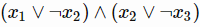

Find an assignment of values for each variable that makes the statement true. For example, the above equation is satisfied if 
<!-- $$x_1 = x_2 = \ttt{true}$$-->
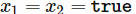 
and 
<!--
$$x_3 = \ttt{false}$$
-->
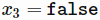. 
Specifically, we only consider boolean statements in _conjunctive normal form_ (CNF) like the one above which have the general form:

<!--
$$(x_i \vee \ldots \vee x_j) \wedge \ldots \wedge (x_{i'} \vee \ldots \vee x_{j'})$$
-->
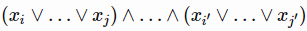

A CNF statement consists of _n_ boolean variables <!--script type="math/tex">x_1, \ldots, x_n</script--> 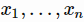 amongst _m_ clauses where each clause has a non-empty subset of the _n_ variables with an optional negating qualifier on each, called a literal. Each clause is a disjunction (OR)—it is true if any of its logical parts are true— and the full statement is a conjunction (AND) of all the clauses.
> Note: SAT is notable because it was the first problem to be proved NP-Complete, i.e. it is in the same complexity class as the Traveling Salesman Problem, Sudoku, and many other such problems. Subsequently, all of these problems can reduce to SAT, which means an efficient SAT solver can be used to accelerate solvers for many kinds of hard problems.

### Problem setup

Your goal in this section will be to write two SAT solvers in Lua, both contained in `sat.lua`. Your SAT solvers will take in CNF expressions, described by the format below.

Variables are represented as strings. An instance of a variable in a clause is called a literal, represented by a table `{variable, affinity}` with the name of the variable and a boolean “affinity” which describes if the variable is negated or not. For example, <!--script type="math/tex">x_1</script--> 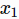 is `{"x1",true}` and <!--script type="math/tex">\neg x_2</script--> 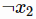 is `{"x2",false}`. A clause is then a list of literals, each implicitly joined by a disjunction. So <!--script type="math/tex">x_1 \vee \neg x_2</script--> 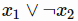 is `{{"x1",true},{"x2",false}}`. A full CNF statement is a list of clauses. Lastly, an assignment is a table mapping from variables to booleans. Below is an example of a CNF representation.

``` lua
-- This table represents "a & (~a | ~b) & (b | c)"
local cnf = {{{"a",true}}, {{"a",false},{"b",false}}, {{"b",true},{"c",true}}}
```

### 1a: Finding one assignment (15%)

_Staff solution is 25 lines of code._

Your first task is to implement the following function:

``` lua
function satisfiable(atoms, cnf)
```

In this signature, `atoms` is a list of all of the variable names that could appear in a literal, and `cnf` is a CNF expression in the form described above. If a satisfying assignment exists, this function must return a table where the variable names are keys and the values are booleans representing what the variable was assigned to. If no assignments exist, return `nil`. If there are multiple satisfying assignments, it does not matter which one you return. The assignment must have an entry for every atom in the CNF.

There are a number of ways to actually implement the search. One way would be to enumerate all <!--script type="math/tex">2^n</script-->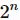 possible assignments and check each one for satisfaction, but this would be unbearably slow for large _n_. Instead we recommend the approach of, for each clause, pick a variable assignment that satisfies that clause, and then given that assignment attempt to satisfy the remaining clauses.

As a basis for your implementation, we have provided you with a complete solution… in OCaml! If you are not certain how to implement satisfiability search, examine the solution in `sat.ml` and think about how to translate from a functional solution into a more imperative one. If you want to build/test the OCaml solution, run:

``` bash
make
./sat.native
```
### 1b: Finding all assignments (25%)

_Staff solution is 35 lines of code._

Your task in this section is to implement a satisfiability function that produces a stream of all possible assignments. The goal here is to use coroutines to create a resumable computation that returns an assignment when found, but continues searching upon request. Specifically, you will implement the following function:

``` lua
function satisfiable_gen(atoms, cnf)
```

This function should return an iterator which enumerates all of the solutions to the expression. For example, you should be able to run:

``` lua
for assignment in satisfiable_gen(atoms, cnf) do
  ...
end
```

This means that anywhere you would return an assignment from the search function, you need to `coroutine.yield` the assignment instead. Calling `satisfiable_gen` will create a new coroutine and return an iterator over that coroutine.

Additionally, in order to extend your solution to 1a to produce all possible solutions, this will require a particular change: any time you want to produce a solution, in the previous code (at least in the OCaml solution), we assigned every unassigned variable to true. Instead, you will need to consider all possible assignments to the unassigned variables, producing a solution for each one.

For example, in the expression <!--script type="math/tex">x_1 \wedge (x_1 \vee x_2)</script-->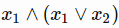, one possible assignment found would be <!--script type="math/tex">[x_1 \rightarrow \ttt{true}]</script-->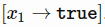. From this base assignment, there are two solutions you can generate: <!--script type="math/tex">[x_1 \rightarrow \ttt{true}, x_2 \rightarrow \ttt{false}]</script-->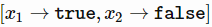 and <!--script type="math/tex">[x_1 \rightarrow \ttt{true}, x_2 \rightarrow \ttt{true}]</script-->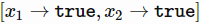.

> Note: This may produce duplicate solutions—don’t worry about this issue. We have provided a deduplication iterator that will eliminate duplicate elements in the solution stream.

### Testing

To test your SAT solver implementations, you can run `sat.lua` as follows:

``` lua
lua sat.lua
```

## Part 2: Datalog

In this section, you will implement two of the core routines underlying our implementation of Datalog, a queryable database of logical predicates like we discussed in class. Be warned that this section comes with a large amount of starter code, so be prepared to read it before diving in.

### Prelude: Records and lists

One new OCaml feature we use in this assignment is _records_. A record is like a struct—it is a composite data type containing multiple named fields of potentially different types (it’s like a product type with labels). Here’s an example of using records:

``` ocaml
type person = {
  name : string;
  age : int;
}

let () =
  let john = {name = "john"; age = 30} in
  Printf.printf "%s: %d\n" john.name john.age
```

Here, the main thing to note is that accessing fields of a record uses the dot notation similar to most other languages.

Additionally, you will want to use the higher-order list functions discussed in class to simplify your code. You can find their type signatures and brief descriptions here: [https://ocaml.janestreet.com/ocaml-core/111.17.00/doc/core/#Core_list](https://ocaml.janestreet.com/ocaml-core/111.17.00/doc/core/#Core_list)

### Datalog preliminaries

Recall from lecture that Datalog programs consists of a database containing facts and inference rules as well as a query. For example, we could have a database that looks like:

``` prolog
likes(mary, john).
likes(john, bethany).
likes(A, B) :- likes(B, A).
likes(A, C) :- likes(A, B), likes(B, C).
```

If I then query this database with something like:

``` prolog
likes(bethany, X)?
```

Then our runtime should deduce the following facts:

``` prolog
likes(bethany, bethany).
likes(bethany, john).
likes(bethany, mary).
```

More generally, our database consists of facts and rules using N-ary relations. A relation is represented in OCaml by a `Relation.t` which contains a `pred` (the name of the predicate) and `terms` as list of `Term.t` values that are either a `Var` (variable, like `X`) or `Symbol` (symbols, like `john`). For example, `likes(bethany, X)` corresponds to:

``` ocaml
{pred = "likes"; terms = [Term.Symbol "bethany"; Term.Var "X"]}
```
A fact is just a relation, but a rule has both a `head : Relation.t` as well as a `body : Relation.t list`. For example, `likes(A, C) :- likes(A, B), likes(B, C).` would be:

``` ocaml
{head = {pred = "likes"; terms = [Term.Var "A"; Term.Var "C"]},
 body = [{pred = "likes"; terms = [Term.Var "A"; Term.Var "B"]};
         {pred = "likes"; terms = [Term.Var "B"; Term.Var "C"]}]}
```

Lastly, a program is both a list of rules (`Rule.t list`) and a list of facts (`Relation.t`) list. Your goal, then, is to build a database that satisfies this signature:

``` ocaml
module type Database = sig
  type t
  val build : Program.t -> t
  val query : t -> Relation.t -> Relation.t list
end
```

Here, an implementation of the database takes a `Program.t` and constructs a `t` (a database) from it, which then can be queries by running `query db a_query` to get back a list of matching facts.

### 2a: Build (50%)

_Staff solution is 15 lines of code._

To implement a `Database`, we will use the _saturation_ strategy described in lecture—that is, given a program, we will deduce all possible facts using our rules. Our database, or the type `t`, will be a `Relation.t list` of all known facts. A query, then is simply matching a given relation against all the facts in the list, and returning the ones that unify.

To finish the implementation of `build`, you will need to implement the `saturate` function:

``` ocaml
val saturate : Rule.t list -> Relation.Set.t -> Relation.Set.t
```
Where `saturate rules facts` returns a set of derivable facts given the input rules and facts. The implementation of `saturate` should follow roughly this imperative pseudocode:

```
function saturate(rules, current_facts):
  new_facts = current_facts
  for rule in rules:
    applicable_facts = []
    for each relation in rule.body:
      add [all applicable facts from current_facts] to applicable_facts
    candidates = cross product of applicable_facts

    new_facts_for_rule = []
    for each candidate in candidates:
      try:
        env = {}
        for each (candidate_relation, rule_relation) in zip(candidate, rule.body):
          env = unify(env, candidate_relation, rule_relation)
        new_fact = substitute env in rule.head
        add new_fact to new_facts_forr
      catch CannotUnify:
        ignore the candidate

    new_facts = new_facts union (new_facts_for_rule as a set)

  if facts == new_facts then return facts  # reached saturation
  else return saturate(rules, new_facts)   # potentially new facts to be found
```

To help you with the inner loops, we have provided you a number of helper functions (extended description with examples is in the code):

* `unify : env -> Relation.t -> Relation.t -> env` - takes an existing environment and two relations, and then attempts to unify the two relations, adding new mappings to the environment if necessary.
* `substitute : Relation.t -> env -> Relation.t` - applies the substitution defined by the environment to the input relation, creating the output relation.
* `applicable_facts : Relation.Set.t -> Relation.t -> Relation.t list` - given an input relation set and a target relation, returns all the relations in the set that share the same name.
* `cross_product : 'a list list -> 'a list list` - returns the cross product of all the sub-lists.

Also, note that the `Relation.Set.t` functions similarly to the `String.Set.t` we saw in the previous assignment, except that it contains `Relation.t` instead of `string`. To implement saturate, you will need to know the following functions:

* `Relation.Set.of_list : Relation.t list -> Relation.Set.t` - converts a list into a set.
* `Relation.Set.union : Relation.Set.t -> Relation.Set.t -> Relation.Set.t` - returns the union of the two input sets.
* `Relation.Set.equal : Relation.Set.t -> Relation.Set.t ->  bool` - returns true if the two sets contain the same elements, false otherwise.

Lastly, each type (`Term.t`, `Relation.t`, `Rule.t`, `Program.t`) comes with a `to_string` function, e.g. `Relation.to_string` that you can use to inspect the state of your program at any point in time via `Printf.printf`.

### 2b: Query (10%)

_Staff solution is 3 lines of code._

Once your database is built (you have a list of all deducible facts), last the last step is to query it. Specifically, your task is to implement the following function:

``` ocaml
val query : Database.t -> Relation.t -> Relation.t list
```

Here, `query db q` takes a database (list of facts), a query (a relation with some number of symbols and variables, e.g. `likes(bethany, X)`), and returns a list of all facts that match. It should follow roughly this imperative pseudocode:

``` ocaml
function query(db, q):
  matching_facts = []
  for fact in facts:
    if fact unifies with q then add fact to matching_facts
  return matching_facts
```

### Testing

You can test your Datalog implementation as follows:

``` bash
make
./test_datalog.sh
```

If you want to run a specific test, pass in the associated “.program” file as an argument.

``` bash
make
./test_datalog.sh tests/saturation/likes.program
```

## Submitting

Once you have completed the assignment, upload the files in your copy of `assign4` to . Then submit.
